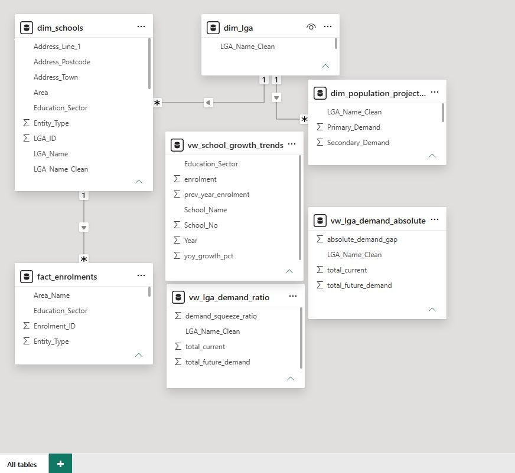
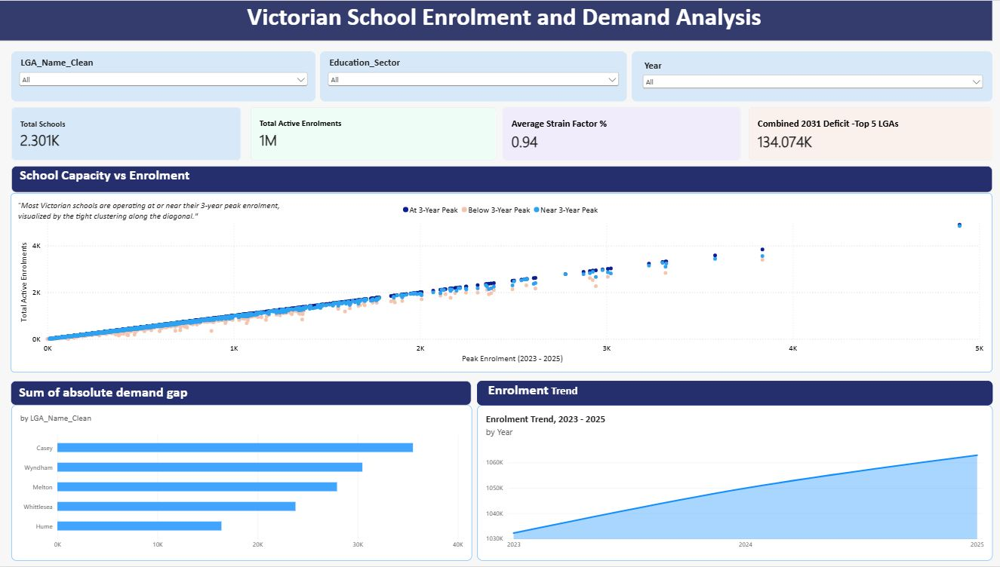
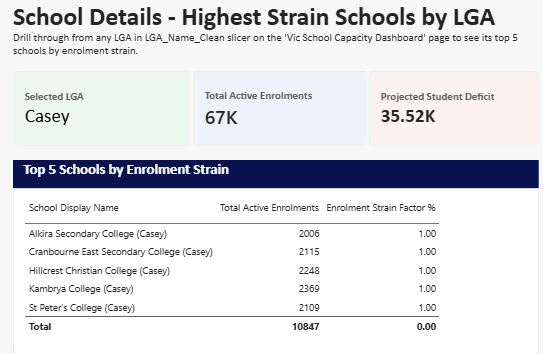
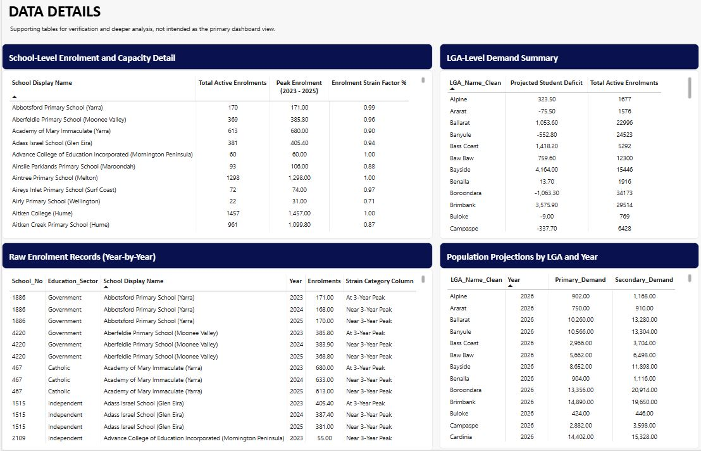

#Victorian School Enrolment and Demand Analysis

An end-to-end data pipeline analysing Victorian government school enrolment trends against population demand projections, to identify capacity pressure and infomr capital works planning. Demonstrates the full Data Engineering, Analytics Engineering, BI Development and Business Analysis pipeline

#Project Overview
Which Local Goverment Area will face the sharpest gap between current school enrolment and projected student demand by 2031?
The project answers by building a complete pipeline; that extracts CSV/Excel files  automatically from the web, performs cleaning of the data, goes through relational database, to an interactive Power BI dashboad and translates the findings into specific capital works recommendations.

#Architecture
Raw Government Files: CSV, Excel, Zip
↓
Python- Automated Web Extraction (data_pipeline/extract.py)
↓
Python- Cleaning& Standardisation (clean_schools.py, clean_enrolments.py, clean_population.py)
↓
SQL Server Database (sql_queries/analytics_queries.sql)
↓
Power BI Dashboard (dashboard/Victorian_School_Enrolment_and_Demand_Analysis.pbix)

#Star Schema Diagram:

#Data Source
https://discover.data.vic.au

School Locations 2025 with school names, addresses, coordinates published by Department of Education Victoria
All Schools FTE Entrolments (2023-2025) with enrolment counts by school and year published by Department of Education, Victoria
Victoria in Future (VIF) 2023 with population projections by LGA and age band to 2026 published by Department of Transport and Planning
Victorian Government School Zones 2026 with school catchment boundaries published by Department of Education, Victoria

#Tech
-Python (Pandas, BeautifulSoup, Requests) for automated extraction, cleaning and standardisation
-SQL(MS SQL Server, Docker) for relational modelling, windows functions and analytical views
-Power BI for data modelling, DAX, interactive dashboard
-GitHub for version control

#Key Skills Demonstrated
Data Engineering: Automated web extraction (bypassing WAF bot protection), multi source data reconciliation, entity resolution(LGA/School Name standardisation), Docker
Analytical Engineering: Star Schema, composite key resolution, SQL window functions (LAG/LEAD, database views, cross-engine SQL(SQLite+ SQL Server using docker and dbeaver)
BI Development: Power BI data modelling, DAX measures, geospatial/scatter visualisation, drill-through interactivity
Business Analysis: Translating dashboard findings into capital works recommendations

#Key Findings
Top 3 LGAs by 2031 absolute demand gap
Lga             2025 Enrolment      2031 Demand     Absolute Gap
Casey           66,705               102,220          35,515
Wyndham         65,465               95,930           30,465
Melton          36,742               64,670           27,929
*See 'docs/phase4_business_strategy.md' for full recommendations

[Phase 4 Business Strategy](docs/phase4_business_strategy.md)

#Dashboard Preview

#Repository Structure
    Vic_School_ELT_and_ETL_Project/

        etl_pipeline/
            data_pipeline/ # Python ETL scripts
            clean_data/ # Cleaned, analysis-ready CSVs
            sql_queries/ # DDL and analytics SQL
        dashboard/
            Victorian_School_Enrolment_and_Demand_Analysis.pbix
            screenshots/
        docs/
            data_quality_notes.md
            phase4_business_strategy.md
            README.md

#Data quality and modelling notes
    see 'docs/data_quality_notes.md for full details

#Limitations and Future Improvements
-Analysis relies on public enrolment and population projection data. Does not account for catchment boundaries  and residential zoning approvals. School Zone 2026 was collected and could extend this analysis further
-Peak Enrolment is the highest enrolment in three year period and not an official building/classroom capacity figure

#Contact
Subash Baskota - subash.baskota@gmail.com